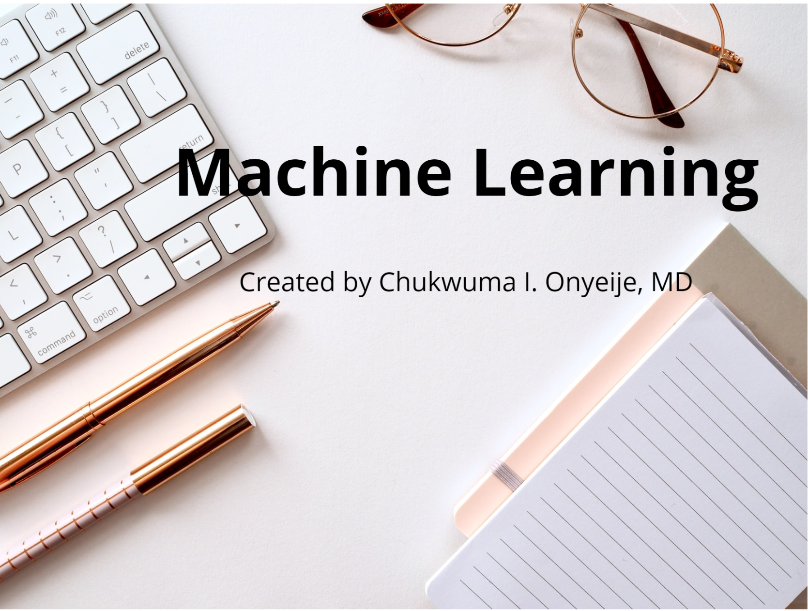

# ML for GTN

## What exactly is Machine Learning?

[Here ](https://slides.com/chukwumaonyeije/deck#/)is a brief presentation on Machine Learning.

## What are the complications of gestational hypertension?

[Here ](https://slides.com/chukwumaonyeije/deck-2a588c)is a presentation on the complications of gestational hypertension.

